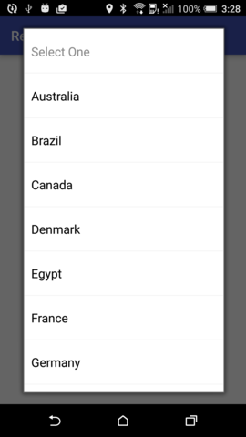
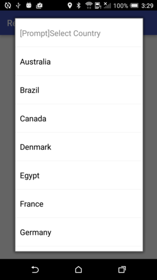

ReuseSpinner
One spinner for your app. Prompt for spinner hint, like "Select One".
<br/><br/>

Installation
-----------
Gradle
```Java
compile 'tw.henrychuang.lib:reuse-spinner:1.0.1'
```
Maven
```Java
<dependency>
  <groupId>tw.henrychuang.lib</groupId>
  <artifactId>reuse-spinner</artifactId>
  <version>1.0.1</version>
  <type>pom</type>
</dependency>
```

<br/>

How to Use
-----------
1.Import module **lib_commonspinner**

2.Add activity node to AndroidManifest.xml
        
        <activity android:name="tw.henrychuang.lib.SpinnerActivity"
            android:theme="@android:style/Theme.Translucent.NoTitleBar" />

3.Pass resource for spinner
```Java
  Intent intent = new Intent(MainActivity.this, SpinnerActivity.class);
  intent.putExtra(SpinnerActivity.Extra_Resource, arrayList);
  startActivityForResult(intent, mRequestCode_select_country_prompt);
```
4.Get select item with onActivityResult
```Java
   @Override
    protected void onActivityResult(int requestCode, int resultCode, Intent data) {
        // TODO Auto-generated method stub
        super.onActivityResult(requestCode, resultCode, data);

        if(requestCode == mRequestCode_select_country && resultCode == RESULT_OK){
            if(data != null){
                Map.Entry<String,String> entry = (Map.Entry<String,String>) data.getSerializableExtra(SpinnerActivity.Result_Data);
                if(entry != null){
                    Log.i(TAG, String.format("get result -> key:%s , value:%s", entry.getKey(), entry.getValue()));

                }
            }
        }
    }
```

<br/>

ScreenShot
-----------
**Spinner with default prompt**<br/>


<br/>
**Spinner with custom prompt**<br/>


<br/>

License
-------
Apache License Version 2.0
http://apache.org/licenses/LICENSE-2.0.txt
